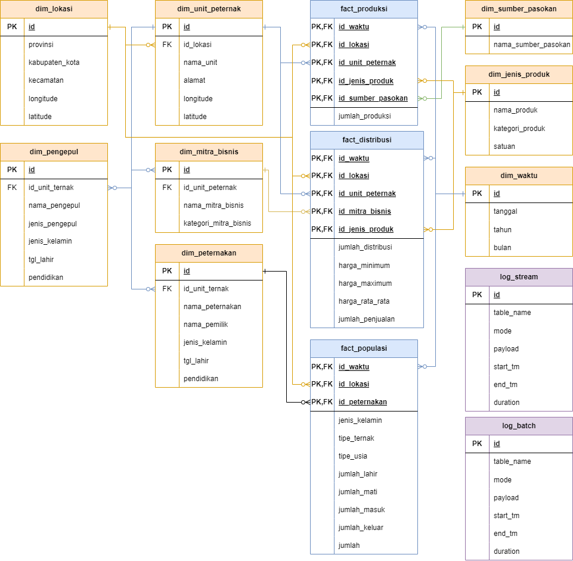

# Puska Farm - Data Warehouse

## Description
Puska Farm - Data Warehouse schema and instance definition. Based on **Postgres** database with **Galaxy Schema**. Deployed as containerized application. Data seeds are produced from **Puska Apps** database (only for dimensions and injected data). Seed are included as [query](./query/seed/) and as [CSV data](./src/seed/).

## Related Project
1. Puska Farm - ETL
2. Puska Farm - ML

## Relations


Table List
|Name|Type|Description|
|:--|:-:|:--|
|dim_jenis_produk|DIM|Reference for product types|
|dim_lokasi|DIM|References for geolocation|
|dim_pengepul|DIM|Reference for collector|
|dim_peternakan|DIM|Reference for farms group|
|dim_sumber_pasokan|DIM|Reference for supplier|
|dim_unit_peternak|DIM|Reference for farm units|
|dim_waktu|DIM|Reference for time|
|fact_distribusi|FACT|Daily summary of farm product distribution|
|fact_populasi|FACT|Daily summary of farm livestocks population|
|fact_produksi|FACT|Daily summary of farm product productions|
|log_stream|LOG|Logging for stream ETL|
|log_batch|LOG|Logging for batch ETL|


## Deployment
This project directly derived from Postgres image with extra process:
- Init tables
- Inject seed data

The initial configuration for services are the same with base Postgres image.

***NB: Make sure to not change /seed volumes to avoid any init phase errors**

To build new image, go to **src/** directory and run:
```sh
docker build -t puska-farm-dwh .
```

To deploy new services, run:

**Bash**
```sh
docker run \
    -e POSTGRES_PASSWORD=puska \
    -e POSTGRES_USER=puska \
    -e POSTGRES_DB=puska \
    --rm -d \
    --name puska-farm-dwh \
    -p 5601:5432 \
    puska-farm-dwh:latest
```

**Powershell**
```powershell
docker run `
    -e POSTGRES_PASSWORD=puska `
    -e POSTGRES_USER=puska `
    -e POSTGRES_DB=puska `
    --rm -d `
    --name puska-farm-dwh `
    -p 5601:5432 `
    puska-farm-dwh:latest
```

**Docker Compose**
```yml
version: "3"
services:
    db-dwh:
        build:
            context: ./puska-farm-dwh/src/postgres
        environment:
            - POSTGRES_PASSWORD=${DWH_DB_PASSWORD:-puska}
            - POSTGRES_USER=${DWH_DB_USER:-puska}
            - POSTGRES_DB=${DWH_DB_NAME:-puska}
        ports:
            - 5601:5432
```